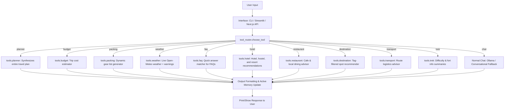
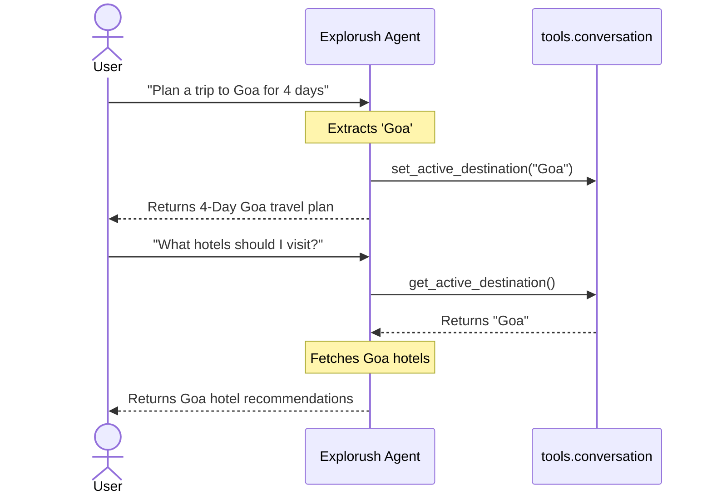

# Explorush AI Travel Agent

Explorush AI Travel Agent is an intelligent travel assistant and trip planner. It acts as a knowledgeable travel consultant to help users plan trips, get budget estimates, receive weather-aware guidance, generate customized packing lists, and discover local sightseeing, dining, and adventure activities—while keeping trekking as a core capability.

---

## Architecture & Flow

### Main Runtime Flow

The assistant routes inputs using an upgraded keyword & regex-based deterministic router. When Ollama is offline or uninstalled, it falls back to rich local rule-based databases, ensuring high availability.



### Active Destination Context Flow (Trip Memory)

When a destination is detected, it is saved in a session state. Follow-up queries that do not contain a destination will automatically inherit this active context.



---

## Folder Structure

```text
ai-trek-agent/
│
├── chat_agent.py          # Terminal CLI interactive interface
├── ui.py                  # Streamlit web interactive interface
├── test_db.py             # Offline parameter extraction testing tool
├── requirements.txt       # Python package dependencies
├── README.md              # Project documentation
│
├── data/
│   └── treks.json         # Old trekking details DB (preserved)
│
├── memory/
│   ├── chat_history.txt   # Conversational log
│   └── session.json       # Session state (active destination context)
│
├── tools/                 # Modular travel tools
│   ├── __init__.py
│   ├── activities.py      # Adventure sports, camping, beaches
│   ├── budget.py          # Budget estimator calculations
│   ├── conversation.py    # Session and context memory manager
│   ├── currency.py        # Forex cards and cash exchange advice
│   ├── destination.py     # Budget/tag filtered recommendations
│   ├── emergency.py       # Scams, safety advice, helplines
│   ├── events.py          # Culture, seasonal local festivals
│   ├── faq.py             # Answers to common travel FAQs
│   ├── geocoder.py        # Geocoding search helper
│   ├── hotel.py           # Hotel, hostel, and resort guides
│   ├── itinerary.py       # General daily travel itineraries
│   ├── location_extractor.py # Legacy location wrapper
│   ├── nearby.py          # Sightseeing, photography spots, hidden gems
│   ├── packing.py         # Monsoon/Beach/Winter/Camping packing lists
│   ├── planner.py         # Main aggregator for full trip plans
│   ├── restaurant.py      # Cafe, dining, and local street food guides
│   ├── transport.py       # Flight, train, cab, road trip routes
│   ├── trek.py            # Unified trekking summaries & difficulty
│   ├── trip_details.py    # Regex & LLM parameter extractor
│   ├── trip_type.py       # Solo, couple, family, group guidelines
│   ├── visa.py            # Schengen, VoA, and outbound visa guidelines
│   └── weather.py         # Weather-aware safety advisory
│
└── web/                   # Next.js web application
    ├── package.json
    ├── src/
    │   ├── app/
    │   │   ├── page.tsx   # Dashboard main page
    │   │   └── api/chat/  # Chat API endpoint
    │   ├── components/# Explorush custom console components
    │   └── lib/
    │       ├── agent.ts   # Next.js agent routing & fallbacks
    │       └── treks.ts   # Next.js destinations mock database
    └── tsconfig.json
```

---

## Installation & Setup

### Prerequisites
- Python 3.10+
- Node.js 18+ (for Web App)
- Ollama (Optional, for dynamic LLM support)

### Python Backend Setup
1. Clone the project repository.
2. Create and activate a virtual environment:
   ```bash
   python -m venv venv
   .\venv\Scripts\activate  # On Windows PowerShell
   ```
3. Install dependencies:
   ```bash
   pip install -r requirements.txt
   ```
4. If using Ollama, pull the required model:
   ```bash
   ollama pull phi3
   ```

### Running Python Interfaces
- **Terminal CLI**:
  ```bash
  python chat_agent.py
  ```
- **Streamlit Web UI**:
  ```bash
  streamlit run ui.py
  ```

### Running Next.js Web App
1. Navigate to the web folder:
   ```bash
   cd web
   ```
2. Install dependencies:
   ```bash
   npm install
   ```
3. Run the Next.js dev server:
   ```bash
   npm run dev
   ```
4. Open `http://localhost:3000` in your browser.

---

## Example Queries & Routing

| Input | Selected Tool | Action |
| :--- | :--- | :--- |
| *"I'm going to Goa for 4 days"* | `planner` | Generates full summary, transport, stays, daily itinerary, budget, weather, and tips. |
| *"Suggest weekend trips from Mumbai under 10000"* | `destination` | Suggests Lonavala, Alibaug, and Rajmachi matching tags and budget limit. |
| *"Is Manali safe?"* | `faq` | Returns seasonal safety warning about monsoons and black ice. |
| *"What restaurants should I visit?"* | `restaurant` | Uses active destination context to recommend cafes and local foods. |
| *"How difficult is Harihar?"* | `trek` | Pulls difficulty rating (Hard) and fort elevation from the local database. |


 .\venv\Scripts\activate   
 streamlit run ui.py   
cd web
npm install
npm run dev

---

## Future Scope
- **Real-time APIs**: Integrate Skyscanner API for live flight prices and Booking.com API for real-time room availability.
- **Auto-acclimatization Alerts**: Warn users automatically if they plan a trip above 10,000 ft without rest days.
- **Interactive Map Visuals**: Embed Google Maps or Leaflet inside the Next.js and Streamlit interfaces showing the daily itinerary route points.
