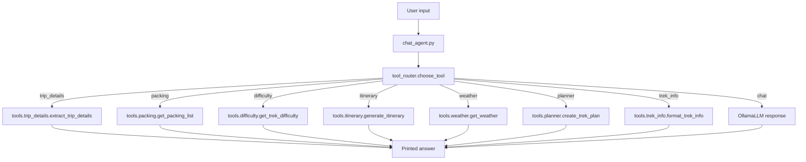

# AI Trek Agent

AI Trek Agent is a local trekking assistant for Maharashtra-focused trek planning. It uses Ollama-backed LLM calls plus a small set of deterministic tools to answer trek questions, build plans, estimate difficulty, suggest packing, check weather, and extract trip details.

## What This Project Does

The assistant can handle:

- trek recommendations
- trek planning
- packing advice
- difficulty estimation
- itinerary generation
- weather-aware guidance
- trek information lookup
- basic trip detail extraction, including date and time

## Project Flow

### Main Runtime Flow



### How It Works

1. `chat_agent.py` reads the user's message.
2. `tool_router.choose_tool()` matches the message to a tool keyword.
3. If a tool matches, the agent runs the corresponding function in `tools/`.
4. If no tool matches, the message falls back to the normal chat prompt.
5. The response is printed in the terminal and stored in `memory/chat_history.txt`.

### Trip Details Flow

The trip-details path uses two extractors:

- `tools.location_extractor.extract_location()` for the trek name
- `tools.date_time_extractor.extract_date_time()` for date and time

This produces a structured output like:

```text
TREK: Kalsubai
DATE: Tomorrow
TIME: Morning
```

## Entry Points

### 1. `chat_agent.py`

Interactive terminal agent with tool routing and short conversation memory.

Use this when you want the full assistant experience.

### 2. `ui.py`

Streamlit web UI for a lightweight chat experience.

Use this when you want a browser interface instead of the terminal.

### 3. `app.py`

Minimal Ollama smoke test that sends a single prompt to the model.

Use this to confirm Ollama and the model are reachable.

### 4. `test_db.py`

Small loop for testing trip-detail extraction from a prompt.

## Tool Routing

The router in `tool_router.py` selects one of these tool labels:

- `trip_details`
- `planner`
- `packing`
- `difficulty`
- `itinerary`
- `weather`
- `trek_info`
- `chat`

### Example Matches

- `plan a trek`, `trek plan`, `plan my trek` -> `planner`
- `packing list`, `what should i carry` -> `packing`
- `difficulty`, `how difficult` -> `difficulty`
- `itinerary`, `schedule` -> `itinerary`
- `weather`, `forecast`, `temperature`, `rain` -> `weather`
- `tell me about`, `details about`, `height`, `duration` -> `trek_info`
- date/time words such as `today`, `tomorrow`, `morning`, `evening`, `night`, `this weekend`, `next weekend` -> `trip_details`

## Tool Details

### `tools/location_extractor.py`

Extracts the trek or location name from user text with help from the LLM.

### `tools/date_time_extractor.py`

Deterministically extracts date and time keywords from user text.

### `tools/trip_details.py`

Combines trek extraction and date/time extraction into one structured response.

### `tools/planner.py`

Builds a full trek plan by combining:

- dynamic trek info
- weather
- smart packing
- itinerary
- safety tips

### Other tool modules

- `tools/packing.py` -> packing lists
- `tools/difficulty.py` -> trek difficulty
- `tools/itinerary.py` -> basic itinerary generation
- `tools/weather.py` -> weather information
- `tools/trek_info.py` -> trek information summary
- `tools/safety.py` -> safety tips
- `tools/smart_packing.py` -> weather-aware packing
- `tools/dynamic_trek_info.py` -> richer trek details
- `tools/wiki_search.py` -> wiki-backed lookup helper
- `tools/geocoder.py` -> location geocoding support

## Setup

### Prerequisites

- Python 3.10 or newer
- Ollama installed locally
- The `phi3` model pulled into Ollama

### Install Dependencies

This repo does not currently include a dependency lock file, so install the main packages manually:

```bash
pip install langchain-ollama streamlit
```

If other tool modules require extra packages in your environment, install them as needed.

### Ollama Model

Make sure the `phi3` model is available:

```bash
ollama pull phi3
```

## How To Run

### 1. Run the main chat agent

```bash
python chat_agent.py
```

Type a trekking question and the router will decide which tool to use.

### 2. Run the Streamlit UI

```bash
streamlit run ui.py
```

### 3. Run the simple model smoke test

```bash
python app.py
```

### 4. Test trip detail extraction

```bash
python test_db.py
```

## Example Inputs

### Trip details

```text
Kalsubai tomorrow morning
```

Expected output:

```text
TREK: Kalsubai
DATE: Tomorrow
TIME: Morning
```

### Planner

```text
Plan a trek to Harishchandragad
```

### Packing

```text
What should I carry for a monsoon trek?
```

### Weather

```text
Weather at Ratangad
```

## Memory

The main chat agent stores short conversation history in:

```text
memory/chat_history.txt
```

This helps the assistant keep limited context across turns.

## Data Files

- `data/treks.json` contains trek-related data used by the project.

## Notes

- The chat agent uses a bounded memory window so prompts do not grow forever.
- Tool outputs are printed directly in the terminal.
- The trip-details route is intentionally deterministic for date and time extraction.

## Troubleshooting

### `langchain_ollama` import error

Make sure you installed dependencies in the same Python environment you use to run the project.

### Ollama connection issues

Check that the Ollama service is running and that `phi3` is installed.

### Unexpected chat response instead of a tool

The router is keyword-based. Rephrase the input using one of the known tool phrases.

## Suggested Next Improvements

- add a `requirements.txt`
- expand the router with more natural language matches
- add tests for each tool branch
- surface trip details in the Streamlit UI
