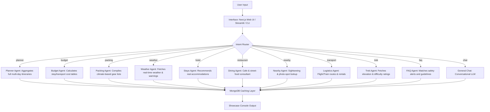
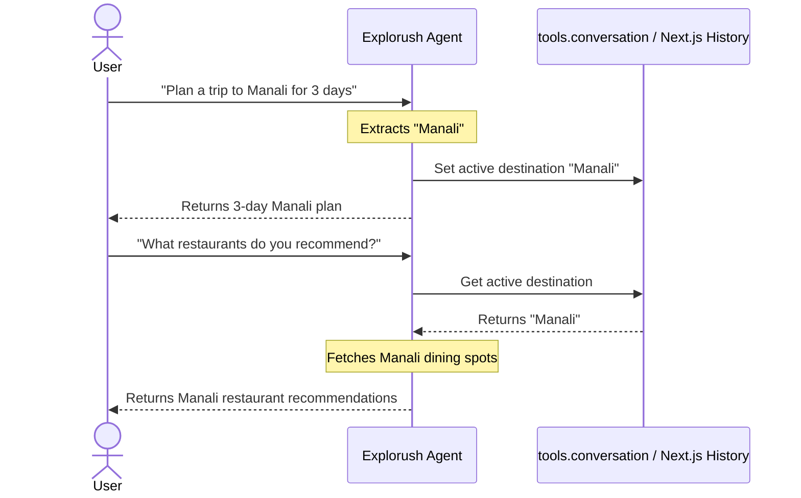

# Explorush: AI Travel Agent & Trekking Consultant 🎒✈️

**Explorush** is a production-ready, modular AI travel assistant and trip planner. It operates as an intelligent multi-agent network, routing user queries to specialized sub-agents (e.g., planners, budget calculators, weather advisors, dining consultants) while integrating seamless caching with MongoDB Atlas. It features a modern dual-fronted stack: a local CLI/Streamlit interface for administration and diagnostics, and a responsive **Next.js Web Application** for client-ready deployment.

---

## 🧭 Multi-Agent Routing Architecture

When a user submits a prompt, it passes through a deterministic regex & keyword router. Based on the extracted intent, the request is dispatched to the corresponding sub-agent.



### 🧠 Trip Memory (Active Context Flow)
Explorush maintains a session-based destination context. If a user starts by saying *"I'm going to Goa for 4 days"* and follows up with *"What should I pack?"*, the system automatically inherits "Goa" as the active context:



---

## 🛠️ Specialized Sub-Agents

| Agent | Intent Keywords | Functionality |
| :--- | :--- | :--- |
| **🗺️ Planner** | `plan a trip`, `itinerary`, `road trip` | Aggregates daily routes, stays, and packing checklists into a unified proposal. |
| **💰 Budget** | `budget`, `cost`, `price`, `expensive` | Generates a detailed expense markdown table (Stay, Transport, Contingency) in INR (₹). |
| **🏨 Hotel** | `hotel`, `hostel`, `homestay`, `stay` | Suggests 3 verified properties mapped to budget, mid-range, or luxury tiers. |
| **🍽️ Restaurant** | `restaurant`, `cafe`, `food`, `dining` | Recommends local culinary spots, street food markets, and popular eateries. |
| **🎒 Packing** | `pack`, `carry`, `luggage`, `checklist` | Compiles a checklist categorized by gear, apparel, and documents. |
| **🌤️ Weather** | `weather`, `forecast`, `temperature` | Analyzes climate windows and provides safety advisories (monsoon slips, black ice). |
| **🧗 Trek** | `trek`, `fort`, `difficulty`, `height` | Queries local database for elevation, trail reviews, and gear recommendations. |
| **🚇 Transport** | `flight`, `train`, `bus`, `cab`, `route` | Maps out flight/train connections and highway driving durations. |
| **🔍 Nearby** | `sightseeing`, `hidden gems`, `attractions` | Compiles major tourist sights alongside offbeat spots and photography spots. |
| **🚨 Emergency** | `safety`, `emergency`, `scams`, `helpline` | Provides immediate emergency contact directories and warning alerts. |
| **❓ FAQ** | `when to visit`, `is it safe`, `can I go` | Answers seasonal safety and travel queries instantly. |

---

## 💾 Caching & Database Schema (MongoDB Atlas)

Explorush uses a **single-document-per-destination** design to store generated content. This minimizes read operations and limits LLM API request costs.

### Unified Destination Schema:
```json
{
  "_id": "ObjectId",
  "destination": "Kashmir",
  "normalizedDestination": "kashmir",
  "createdAt": 1719912000,
  "lastUpdated": 1719912000,
  "lastAccessed": 1719915600,
  "totalHits": 12,
  "sections": {
    "planner_3d_1p_mid-range": {
      "response": "...Markdown text of the travel plan...",
      "createdAt": 1719912000,
      "updatedAt": 1719912000,
      "lastAccessed": 1719915600,
      "hitCount": 5,
      "source": "groq",
      "version": "1.0",
      "expiry": null
    },
    "weather": {
      "response": "...Weather advice text...",
      "createdAt": 1719912000,
      "updatedAt": 1719912000,
      "lastAccessed": 1719915600,
      "hitCount": 7,
      "source": "groq",
      "version": "1.0",
      "expiry": 3600
    }
  }
}
```
*   **Performance Optimization**: An index is created automatically on `{ normalizedDestination: 1 }` with a `{ unique: true }` constraint.
*   **Dual Cache Fallback**: When MongoDB is offline, the systems fallback to `data/travel_cache.json` automatically, guaranteeing high availability.

---

## 📂 Project Directory Structure

```text
ai-trek-agent/
│
├── chat_agent.py          # Terminal CLI interactive interface
├── ui.py                  # Streamlit web interactive interface
├── import_data_to_mongo.py# Data ingestion script for MongoDB initialization
├── test_connections.py    # Database & LLM connectivity checker
├── test_kb.py             # Knowledge Base (caching) verification test
├── test_db.py             # Deterministic parameter extraction testing
├── requirements.txt       # Python package dependencies
├── README.md              # Project documentation
│
├── data/
│   ├── treks.json         # Master trekking database
│   └── travel_cache.json  # Local JSON fallback cache
│
├── memory/
│   ├── chat_history.txt   # Persistent conversational log
│   └── session.json       # Session memory (active destination tracker)
│
├── tools/                 # Python modular sub-agent library
│   ├── __init__.py
│   ├── planner.py         # Main itinerary aggregator
│   ├── budget.py          # Cost estimator calculations
│   ├── hotel.py           # Hotel & resort guides
│   ├── restaurant.py      # Cafe, dining, and local street-food advisor
│   ├── packing.py         # Gear list compiler
│   ├── weather.py         # Weather advisory & forecasts
│   ├── transport.py       # Flight, train, highway driving routes
│   ├── trek.py            # Fort & trail summaries
│   ├── conversation.py    # Session memory manager
│   └── ...
│
└── web/                   # Next.js Web Application
    ├── package.json       # Node dependency file
    ├── src/
    │   ├── app/
    │   │   ├── page.tsx   # Dashboard UI entry point
    │   │   └── api/chat/  # Chat API endpoint handler (route.ts)
    │   ├── components/
    │   │   └── trek-dashboard.tsx # Main Console panel
    │   └── lib/
    │       ├── agent.ts   # Next.js intent routing & MongoDB caching
    │       └── treks.ts   # Local mock data fallback
    └── tsconfig.json      # TypeScript configuration
```

---

## 🚀 Installation & Local Setup

### 1. Python Environment Setup
1. Open PowerShell / Command Prompt and navigate to the project directory:
   ```bash
   cd ai-trek-agent
   ```
2. Create and activate a virtual environment:
   ```bash
   python -m venv venv
   .\venv\Scripts\activate  # On Windows
   source venv/bin/activate  # On macOS/Linux
   ```
3. Install dependencies:
   ```bash
   pip install -r requirements.txt
   ```

### 2. Configure Environment Variables
Create a `.env` file in the project root directory:
```env
MONGODB_URI=mongodb+srv://<username>:<password>@cluster.vkorkld.mongodb.net/?retryWrites=true&w=majority
GROQ_API_KEY=gsk_your_groq_api_key_here
```

### 3. Initialize & Ingest Mock Data
Populate your MongoDB Atlas database with the default treks and cached plans:
```bash
python import_data_to_mongo.py
```

### 4. Run Python Diagnostics & Interfaces
*   **Run Diagnostics**: Confirm connections to Groq and MongoDB Atlas are working:
    ```bash
    python test_connections.py
    python test_kb.py
    ```
*   **Run Streamlit Web UI**:
    ```bash
    streamlit run ui.py
    ```
*   **Run CLI Terminal Agent**:
    ```bash
    python chat_agent.py
    ```

### 5. Run Next.js Web App
1. Move to the web folder:
   ```bash
   cd web
   ```
2. Install Node modules:
   ```bash
   npm install
   ```
3. Run the Next.js development server:
   ```bash
   npm run dev
   ```
4. Access the dashboard at `http://localhost:3000`.

---

## ☁️ Vercel Production Deployment

### 1. Set Environment Variables
When deploying the Next.js project on Vercel, navigate to **Project Settings > Environment Variables** and add:
*   `MONGODB_URI`: Your MongoDB Atlas connection string.
*   `GROQ_API_KEY`: Your Groq Cloud API Key.

### 2. Configure MongoDB Atlas IP Access (Critical)
Because Vercel serverless functions scale dynamically and use varying IP addresses, your MongoDB Atlas cluster will block connection requests unless its firewall is open.
1. Open the [MongoDB Atlas Console](https://cloud.mongodb.com/).
2. Under **Security** in the left sidebar, select **Network Access**.
3. Click **Add IP Address**.
4. Set the **Access List Entry** to:
   ```text
   0.0.0.0/0
   ```
5. Click **Confirm** and wait 30 seconds for the status to turn **Active**.

*Note: The combined atomic update feature inside `web/src/lib/agent.ts` is fully optimized to handle serverless cold starts and prevent socket freezes.*
